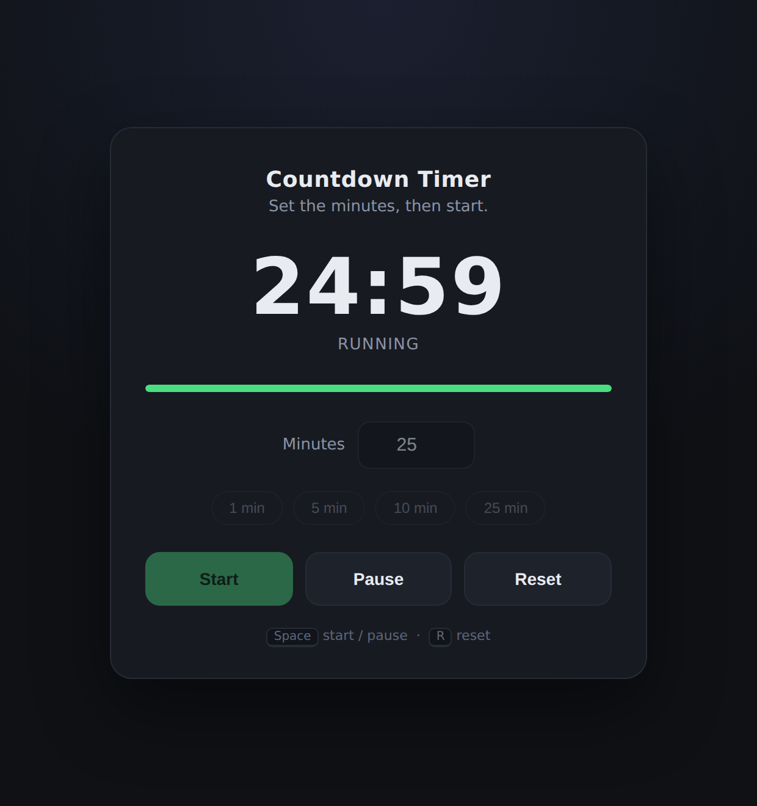

# Countdown Timer

A single-file countdown timer in plain HTML, CSS and JavaScript. No build step, no dependencies.

**Open `index.html` in any browser.**

## Features
- Set any duration in minutes (0–999), or use the 1 / 5 / 10 / 25 min presets
- Start, Pause, Resume, Reset
- Progress bar that turns amber under 1 minute and red under 10 seconds
- Live countdown in the browser tab title
- Flash + beep when time is up
- Keyboard: `Space` = start/pause, `R` = reset
- Drift-free: counts against a wall-clock deadline rather than accumulating `setInterval` error

